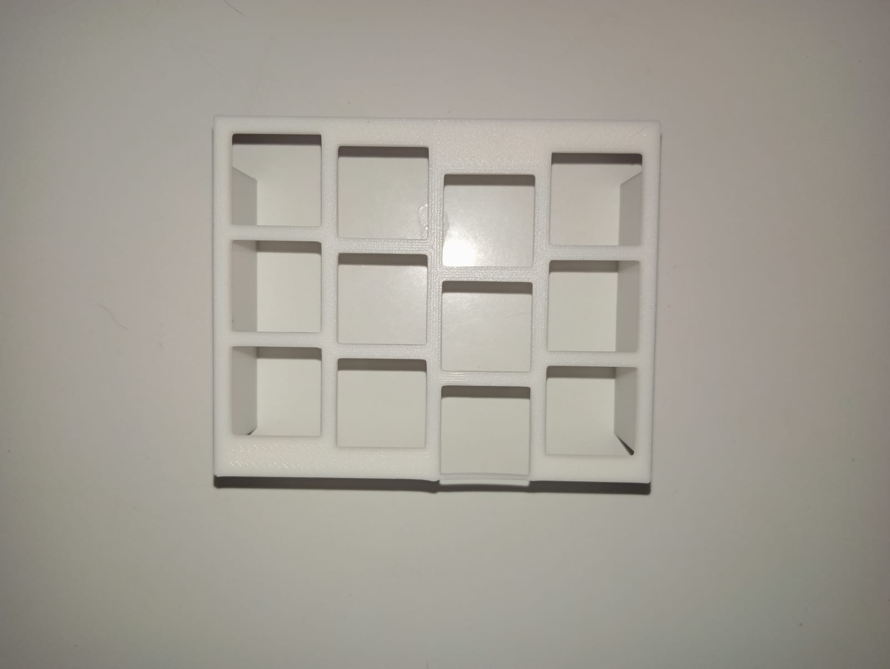
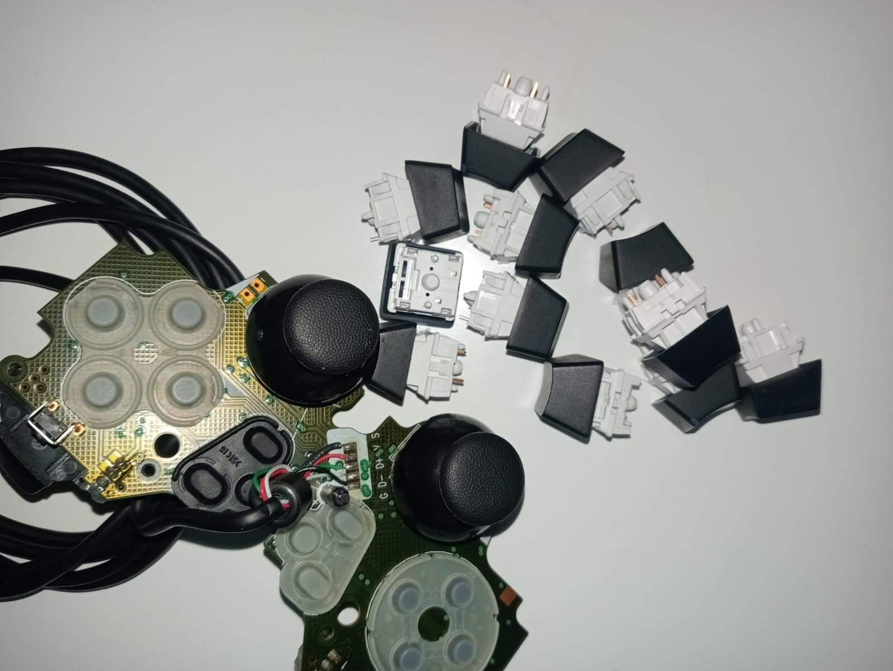
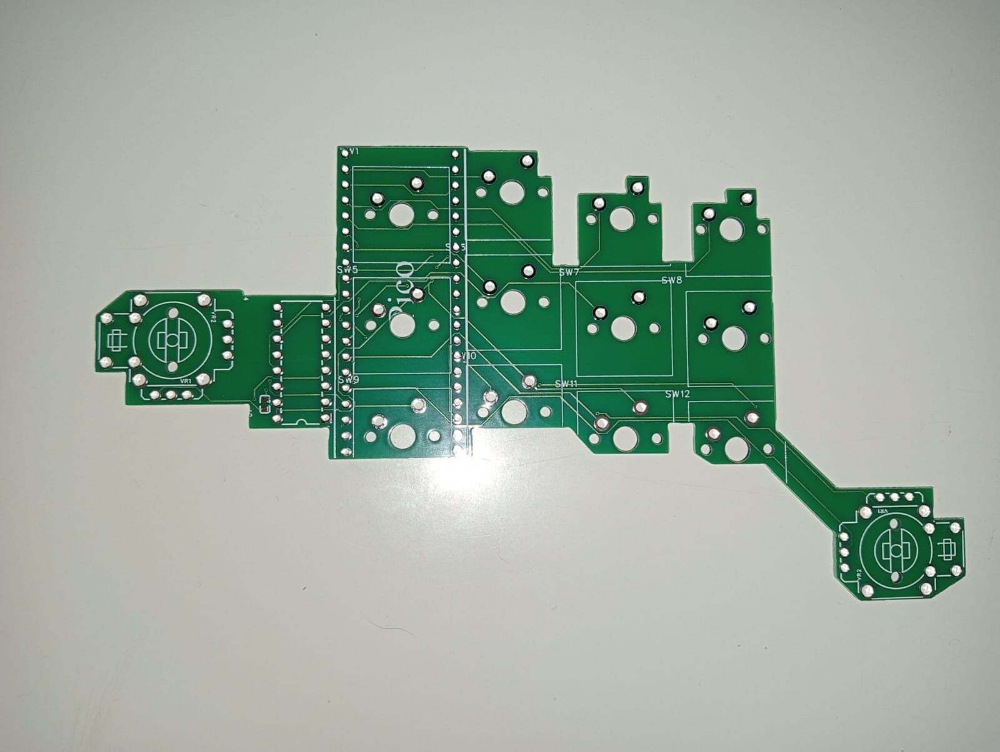
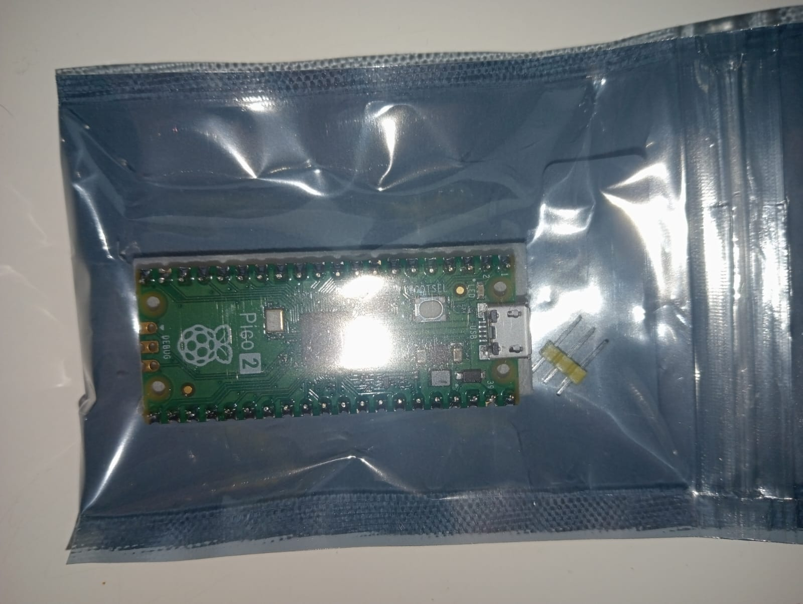

# PrimeKeys

**Ergonomic curved keyboard with analog thumb & pinky controls**

---

## Description
PrimeKeys is a next-level input device: not just a 61-key array, but a hand-enveloping keyboard that allows users to control their computer with every muscle of the hand, integrating analog thumb and pinky controls for advanced, fluid input. It combines ergonomics, custom PCB, 3D-printed layouts, and software for full user customization.

---

## State of the Project
- PCB hub received and functional
- Iterative 3D-printed layouts for ergonomic testing
- Switches purchased, analog modules salvaged from a Logitech controller
- Raspberry Pi Pico used for prototyping

---

## Objective
- Refine ergonomic designs through iterative testing
- Develop fully optimized PCB for potential small-scale production
- Create a high-quality enclosure inspired by similar projects
- Acquire high-quality switches and analog inputs for final prototypes

---

## Deliverables
1. GitHub repository with PCB files, BOM, STL models, and code
2. Demo video (30–60 seconds) showing PrimeKeys in action
3. Summary video explaining design process and challenges
4. Software for reading inputs and user customization

---

## Links

### 3D Models
- [Layout Test 1](3D_Models/layout_test1.stl)
- [Layout Test 2](3D_Models/layout_test2.stl)
- [Final Enclosure](3D_Models/enclosure_final.stl) 	<!-- File to be added later -->

### PCB
- 
- 			<!-- File to be added later -->
- [Schematic PDF](PCB/pcb1.jpg)

### Other Photos
- 
- 
- 
- 

---

## Motivation
During a school trip to MicroTec, I was exposed to complex hardware for the first time. Observing a high-speed rotating machine, I questioned its design and proposed an alternative approach, which was recognized as creative by the management. This experience sparked my interest in innovative hardware design. Being born with a computer in my hands, I am passionate about creating a unique, ergonomic input device that merges hardware experimentation with real user impact.

---

## Software
- `input_reader.py` — reads inputs from keys and analog controls
- `config.json` — configuration file for mapping and customization
